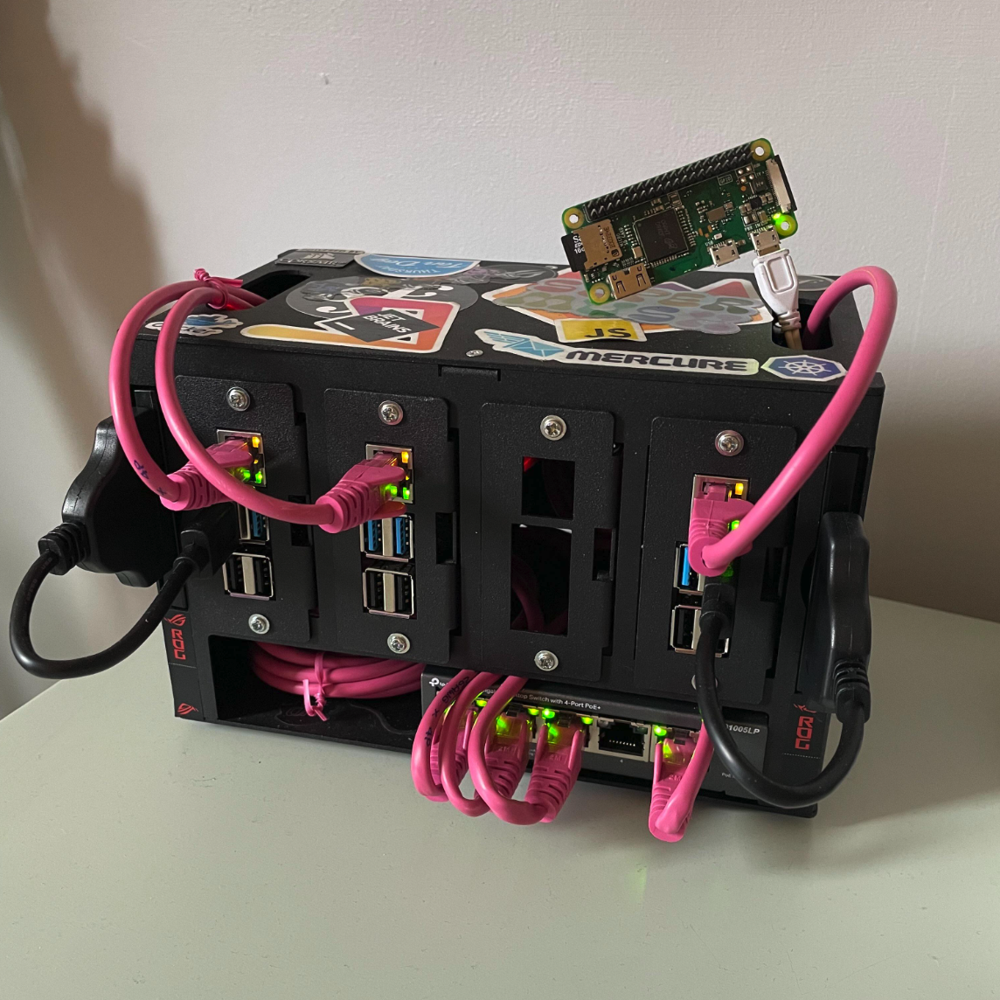

<!-- START doctoc generated TOC please keep comment here to allow auto update -->
<!-- DON'T EDIT THIS SECTION, INSTEAD RE-RUN doctoc TO UPDATE -->
## Contents

- [kubernetes-homelab](#kubernetes-homelab)
  - [Hardware](#hardware)
  - [Environment](#environment)
  - [Monitoring](#monitoring)
  - [Services](#services)

<!-- END doctoc generated TOC please keep comment here to allow auto update -->

# kubernetes-homelab
## Hardware

- x3 [Raspberry PI4 4GB](https://thepihut.com/products/raspberry-pi-4-model-b?variant=20064052740158&src=raspberrypi) + [Raspberry Pi PoE+ HAT](https://thepihut.com/products/raspberry-pi-poe-plus-hat?variant=39862446096579)
- x1 [Raspberry Pi Zero W](https://thepihut.com/products/raspberry-pi-zero-w)
- [5-Port PoE Network Switch](https://www.amazon.co.uk/dp/B08D9G7WPN?psc=1&ref=ppx_yo2ov_dt_b_product_details) + [RJ45 Cat5e](https://thepihut.com/products/rj45-cat5e-ethernet-lan-cable-2m-pink?variant=20063167709246#product-reviews)
- [Cluster case](https://thepihut.com/products/complete-enclosure-for-raspberry-pi-clusters)
- x2 [240GB SSD](https://www.amazon.co.uk/dp/B076Y374ZH?psc=1&ref=ppx_yo2ov_dt_b_product_details) + [SSD to USB 3.0](https://thepihut.com/products/ssd-to-usb-3-0-cable-for-raspberry-pi?variant=38191015559363)

---

## Environment
- Debian GNU/Linux 11 (bullseye) via [ripimager](https://github.com/raspberrypi/rpi-imager)
- Kubernetes via [k3s](https://k3s.io/)
  - w/ [Traefik Ingress Controller](https://docs.k3s.io/networking#traefik-ingress-controller)
  - w/ [Service Load Balancer](https://docs.k3s.io/networking#service-load-balancer)

---

## Monitoring

Using this awesome repo [cluster-monitoring](https://github.com/carlosedp/cluster-monitoring) for of the shelf Raspberry PI(ARM) monitoring

---
## Services
- [x] ~~nginx~~
- [x] ~~rancher demo~~
- [x] [Longhorn](https://longhorn.io/) - Distributed block storage
- [x] [Pi Hole](https://pi-hole.net/) - Network Adblocking
- [ ] [Cert Manager](https://cert-manager.io/docs/installation/) - SSL
- [ ] [Tailscale](https://tailscale.com/) - VPN
- [ ] [Media server](https://www.reddit.com/r/kubernetes/comments/rtiexk/k8smediaserveroperator_your_allinone_resource_for/)
  - [ ] [Plex](https://www.plex.tv/)
  - [ ] [Sonarr](https://sonarr.tv/)
  - [ ] [Jackett](https://github.com/Jackett/Jackett)
